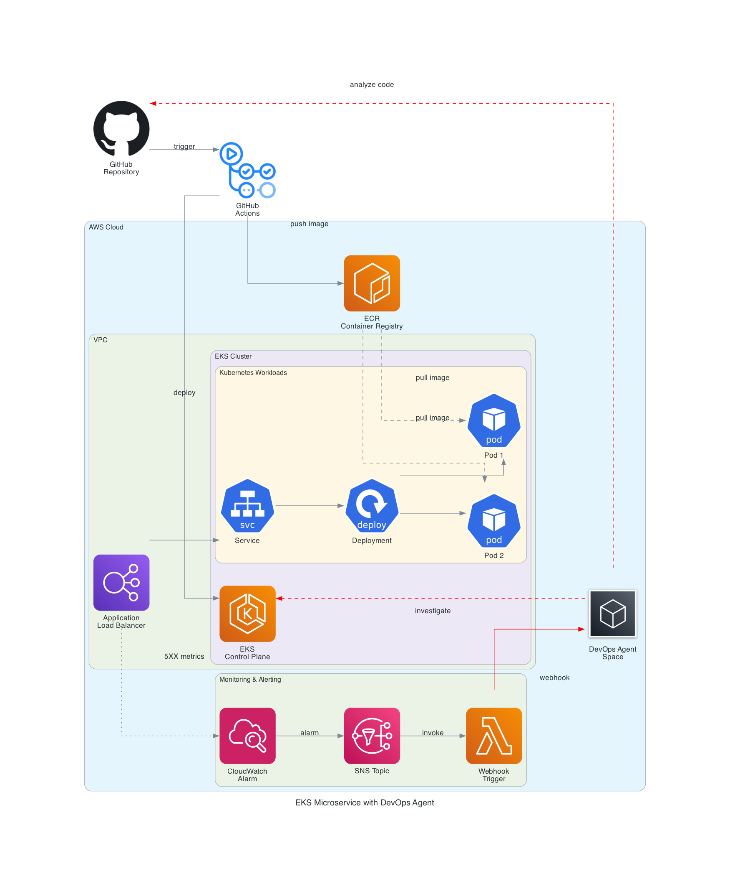

# my-sample-kubernetes-app

## Demo

Change something on the code that could result in 5xx error.
For example a `NullPointerException` on application side.

```diff
 public class HelloController {

     @GetMapping("/hello")
     public Map<String, String> hello(@RequestParam(defaultValue = "World") String name) {
-        Map<String, String> response = new HashMap<>();
+        Map<String, String> response = null;
         response.put("message", "Hello, " + name + "!");
         response.put("service", "sample-microservice");
         return response;
     }
 }
```

The Cloudwatch Alarm will trigger the Investigation in Devops Agent Space

## Architecture



```
cd design

uv venv
source .venv/bin/activate
uv pip install -r requirements.txt

python diagram.py
```

## Setup

1. Create the Capability Provider for Github
1. Fill the `prod.auto.tfvars` acoordingly
1. Execute a `terraform apply`
1. Execute a `kubectl apply -f k8s/`
1. Execute the Github Action to deploy on the cluster and create the ALB
1. Fill the `prod.auto.tfvars` acoordingly
1. Create a Webhook on the DevOps agent space
1. Rename `.env.example` into `.env`, then fill accordingly
1. Execute a `terraform apply`
1. Configure the italian language on the agent space (not available via terraform)
